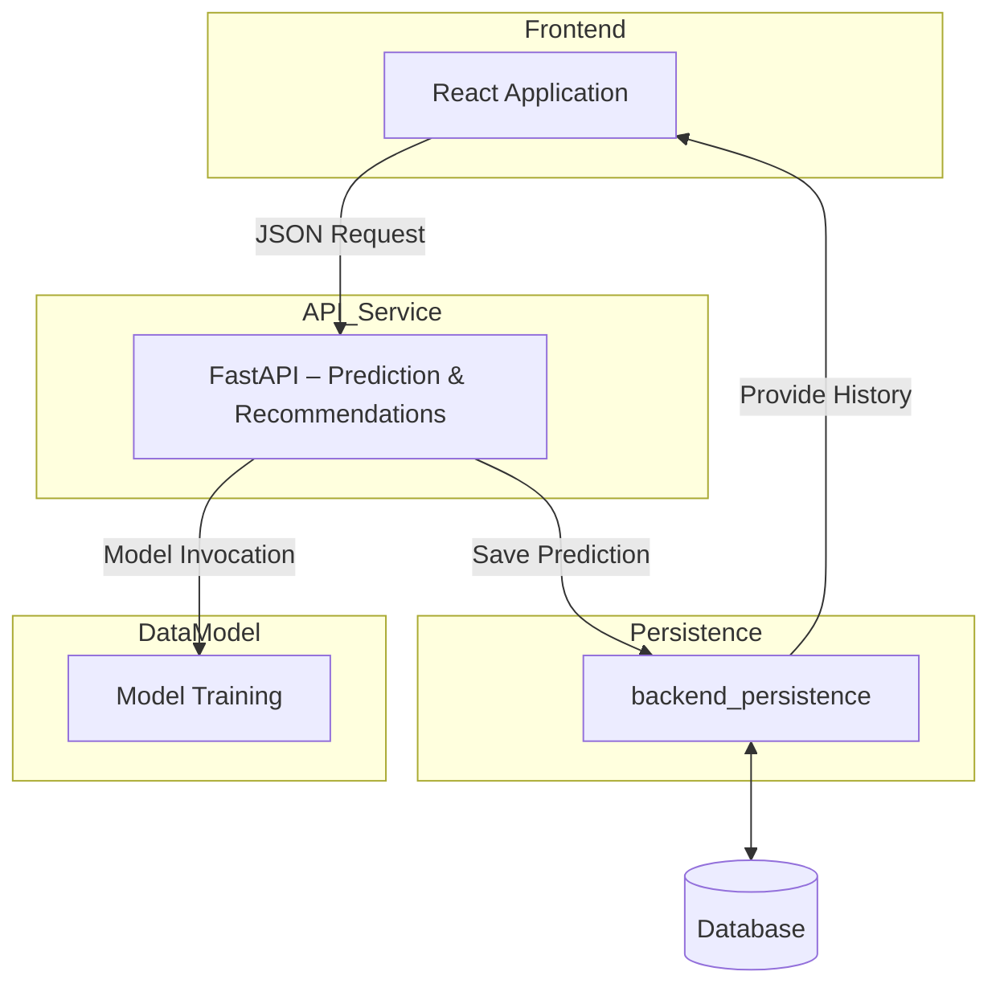

# Insurance Cost Prediction Microservices Suite

## Preview 

A demo of the service is available in addresss: http://51.178.31.60/

## Overview

This repository contains all the services required to deploy a comprehensive solution for **insurance cost prediction** and **tailored insurance plan recommendations** for clients. By leveraging machine learning, we’ve generated models capable of accurately predicting healthcare insurance costs based on user-provided data and proposing suitable insurance plans.

The architecture follows a microservices approach, composed of:

* **data\_model**: data preprocessing and training of ML models
* **api**: FastAPI service exposing prediction and recommendation endpoints
* **backend\_persistence**: service for storing predictions and history
* **frontend**: React/TypeScript application for the user interface

Each service includes its own detailed README in its respective directory.

---

## Architecture & Data Flow



1. The insurers enters client profile data in the frontend.
2. The frontend sends a POST request to the API endpoint `/predict`.
3. The API calls the **data\_model** service to load and execute the ML model.
4. The model returns predicted insurance cost, confidence intervals, and personalized plan recommendations.
5. The API records the prediction in **backend\_persistence** for auditing and history.
6. The frontend can fetch and display the user’s past predictions.

---

## Prerequisites

* Docker & Docker Compose (>= 1.27)
* Node.js (LTS) & npm (for frontend development)
* Python 3.8+ (for standalone execution if needed)

---

## Quick Start (with Docker Compose)

1. **Prepare the environment file**

   * Copy `.env.example` to `.env` in the project root and adjust as needed:

```env
# DATABASE CREDENTIAL - For developpement database
POSTGRES_USER=postgres
POSTGRES_PASSWORD=password
POSTGRES_DB=inssurance_data

# DATABASE URL - For access to database
DATABASE_URL=postgresql://postgres:password@db:5432/inssurance_data

# ENV VALUE FOR FRONTEND
VITE_API_MODEL_URL=http://localhost:8000
VITE_MODEL_ROUTE=/models
VITE_MODEL_PREDICT_SUBROUTE=/predict
VITE_API_PERSISTANCE_URL=http://localhost:8001

# BACKEND URL - FOR DOCKER INTERNAL ACCESS
INSSURANCE_BACKEND_URL=http://inssurance_backend:8000

# SERVER IP (CORS)
SERVER_DOMAIN=http://localhost
```

2. **Build and start all services**

   ```bash
   docker compose -f docker-compose.dev.yml up --build
   ```

   > This will build and launch the database, API, persistence service, and frontend.

3. **Run database migrations**

   ```bash
   docker compose -f docker-compose.dev.yml --profile tools run --rm migrations
   ```

4. **(Optional) Seed fake data**

   ```bash
   docker compose -f docker-compose.dev.yml --profile tools up --build --force-recreate seed
   ```

> **Tip (Linux/macOS)**: prefix commands with `sudo` if you encounter permission errors.

---

## Directory Structure

```text
.
├── api/                   # FastAPI service
├── backend_persistence/   # Prediction storage & history
├── data_model/            # Data prep & ML model training
├── frontend/              # React/TypeScript UI
├── docker-compose.dev.yml # Docker service definitions
└── README.md              # This file
```

---

## Service Documentation

* [data\_model/README.md](./data_model/README.md)  – ML model generation & training citeturn0file0
* [api/README.md](./api/README.md)             – Prediction & recommendation endpoints citeturn0file1
* [frontend/README.md](./frontend/README.md)   – User interface (React) citeturn0file2
* [backend\_persistence/README.md](./backend_persistence/README.md) – Storage & history service citeturn0file3

---

## Local Development

1. Clone the repo and navigate to its root.
2. Start all services:

   ```bash
   docker-compose -f docker-compose.dev.yml up --build
   ```
3. **Frontend-only** (optional):

   ```bash
   cd frontend && npm install && npm run dev
   ```
4. **Standalone service** (optional):

   ```bash
   cd <service-directory>
   python -m venv venv
   source venv/bin/activate
   pip install -r requirements.txt
   uvicorn main:app --reload  # for FastAPI services
   ```

---